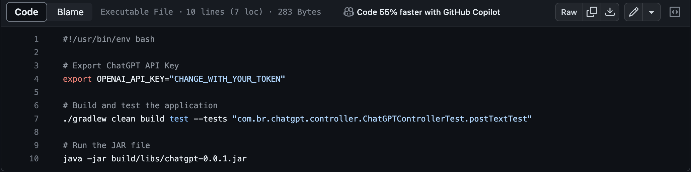
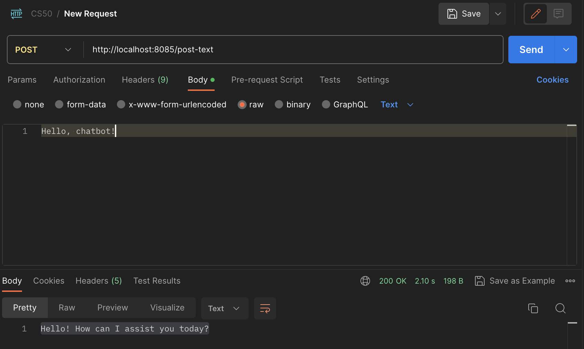
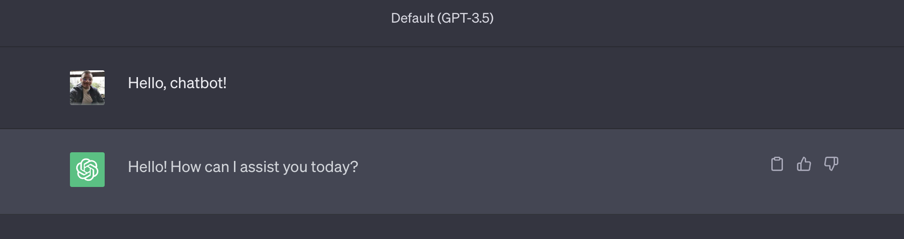

# ChatGPT API Integration

## CS50
>This was my final project for conclude the CS50 Introduction to Computer Sciense course.

## Features

- [Java-Webflux](https://docs.spring.io/spring-framework/reference/web/webflux.html)
- [ChatGPT-API](https://platform.openai.com/docs/api-reference)
- [Junit](https://docs.spring.io/spring-boot/docs/1.5.3.RELEASE/reference/html/boot-features-testing.html)
- [Mockito](https://docs.spring.io/spring-boot/docs/1.5.3.RELEASE/reference/html/boot-features-testing.html)

I've used Spring WebFlux, Junit and Mockito to create my rest API for simulate chatGPT API Integration.

## Explaining the project
For this final project, I've decided to create an API for integration along ChatGPT.

How that kind of topic is in warmup at this moment and a lot of people are talking about artificial intelligence I decided to explain a little bit more about how to use the chatGPT integration API.

In my application, you will find a simple Rest API, This API has the capability to integrate naturally with chatGPT`s API, is enough to pass a single value as an input, and you will get an output, the same compared with the chatGPT in a directly way.

## How does run the ChatGPT rest API

1) We have a bash file called *start.sh*, to execute our application we need to run this command: $bash start.sh, this command will do:
* Export your chatGPT variable for the application. Ps: Don't forget to pass your OWN chatGPT token, without it the program couldn't work.
* Execute the gradlew build and gradle test. Ps: Our application contains a unit test, and it needs to be executed along the build and before the start-up.
* Execute the Java binary file.

2) Now, our application will be running in the server port 8085, that`s enough to call our API.
* Our application will be executed locally, thereby on the address (http://localhost:8085/post-text).
* The (/post-text) is our main API`s path. That will look like this:

* Notice that our POST request just needs a single input as a text, and the API will return a single text as a response, likely the same chatGPT' answer:

3) Notice, that we're using the chatGPT in the model `GPT-3.5` any different model could break up the answer.

## Demonstration on youtube
For the CS50 final project you have to make a video showning your project,
[Final Project presentation](tobechange)

## Conclusion
My thoughts about this project were basically to show you how we can create an easy and quick integration with AI using chatGPT, Besides you use the best HTTP verbs practice, unit test, and a clear and simple code structure.

## About CS50
CS50 is a openware course from Havard University and taught by David J. Malan

Introduction to the intellectual enterprises of computer science and the art of programming. This course teaches students how to think algorithmically and solve problems efficiently. Topics include abstraction, algorithms, data structures, encapsulation, resource management, security, and software engineering. Languages include C, Python, and SQL plus students’ choice of: HTML, CSS, and JavaScript (for web development).

Thank you for all CS50.

- Where I get CS50 course?
  https://cs50.harvard.edu/x/2023/

[LinkedIn Roger Amorim](https://www.linkedin.com/in/roger-amorim-6a932a153/)